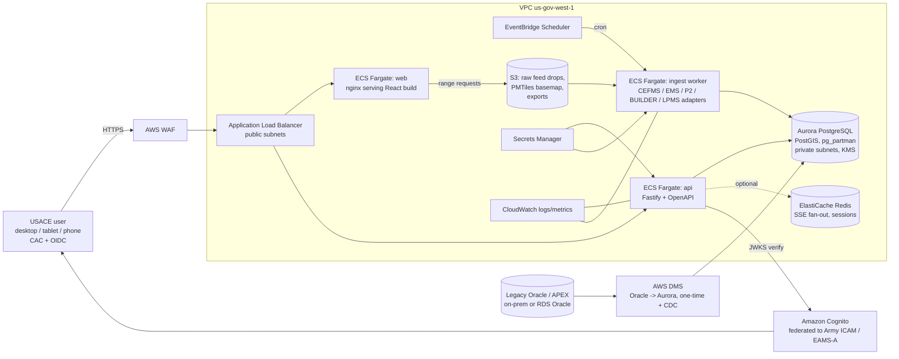

# Enterprise Visibility Suite (EVS): Oracle APEX to Modern Stack
## Target architecture, migration approach, and demo plan for USACE

Prepared for: Cognition federal GTM (USACE demo)  
Date: 2026-10-06  
Scope: research and planning only. No code, repos, PRs, or deployments were created.

---

## 0. Executive summary

1. **Data platform: PostgreSQL.** Amazon Aurora PostgreSQL (or RDS for PostgreSQL) in AWS GovCloud carries a DoD CC SRG IL5 checkmark on the AWS services-in-scope page; the identical engine runs locally in Docker (`postgis/postgis:17-3.5`). This is the only candidate that satisfies IL5, commercial parity, local run, and Oracle migration tooling at once.
2. **Drop TimescaleDB from the parity stack.** The `timescaledb` extension is not offered on RDS or Aurora; use PostgreSQL native partitioning plus `pg_partman` (available on both) for time-series tables. PostGIS is supported on Aurora and RDS and is the right fit for the lock map.
3. **Legacy source for the demo:** Oracle's own **Strategic Planner** starter app (APEX 24.2, 262 pages, 757 regions, 88 Interactive Reports, 341 PL/SQL processes; projects, initiatives, releases, people, kanban). Download verified: `https://raw.githubusercontent.com/oracle/apex/24.2/starter-apps/strategic-planner/strategic-planner.zip` (1.6 MB). Rebrand to USACE programs/P2 projects/labor.
4. **Migration pipeline:** SQLcl split export -> deterministic parser of `wwv_flow_imp_page.create_page/create_page_plug/create_worksheet` calls -> inventory JSON -> ora2pg (schema/data) + Devin (PL/SQL to API handlers, regions to React components, tests, traceability matrix).
5. **API:** Fastify 5 + TypeScript, OpenAPI 3.1 generated from TypeBox schemas (contract-first, one `x-apex-page` tag per endpoint for traceability), OIDC via Keycloak locally and Cognito (IL5 listed) in GovCloud, SSE for lock updates.
6. **Front end:** Vite + React 19 + TypeScript, `@trussworks/react-uswds` (USWDS 3), Recharts 3 with `accessibilityLayer` plus a data-table fallback, MapLibre GL JS with Protomaps PMTiles (single-file basemap on S3, works with no internet).
7. **Hosting:** ECS Fargate for API, ingestion worker, and static web container behind ALB + WAF. CloudFront is IL2 East/West only on the AWS DoD table, so do not put it in the IL5 design.
8. **Cost framing:** Oracle Database EE list price is $47,500 per processor plus $10,450 first-year support (Oracle Technology Global Price List, Sept 15 2026). A GovCloud Aurora PostgreSQL `db.r6g.large` is $0.313/hr (about $2,742/yr). Present as licensing-driver comparison with caveats, never as a TCO.
9. **Demo moments:** live APEX inventory in under a minute, side-by-side page vs generated React page, "add a visualization" in minutes, same dashboard on phone/tablet/desktop, cost slide.
10. **Risk to manage:** "IL5 listed" is a service-level status, the system still needs its own ATO package; say so on the slide.

---

## 1. Assumptions

- Target enclave is AWS GovCloud (US-West or US-East), IL5, with an existing or planned ATO boundary that will inherit AWS service authorizations. Nothing here replaces an ATO package.
- Demo data is synthetic; real CEFMS, EMS, P2/CMP, and BUILDER SMS feeds are represented by CSV/JSON fixtures shaped like those systems. Public data (LPMS lock status) is pulled from the live USACE ORDS endpoint during development and cached as fixtures for the IL5 (no internet) narrative.
- Section 508 / WCAG 2.1 AA design is handled by another session; this report only chooses libraries with a credible accessibility path.
- The team is TypeScript-centric. Python alternatives are noted where they are reasonable.
- "Pinned" means a major version chosen for a stable baseline as of 2026-10-06, taken from the npm registry / Docker Hub on that date.

---

## 2. Data platform selection

### 2.1 Evidence: AWS DoD CC SRG services-in-scope (page "Last updated: October 05, 2026", checked 2026-10-06)

Source: https://aws.amazon.com/compliance/services-in-scope/DoD_CC_SRG/  
Columns on that page: IL2 (East/West), IL2 (GovCloud), IL4 (GovCloud), IL5 (GovCloud), IL6 (Secret Region).

| Service | IL4 GovCloud | IL5 GovCloud | IL6 | Note |
|---|---|---|---|---|
| Amazon Aurora PostgreSQL | Yes | Yes | Yes | |
| Amazon RDS for Postgres | Yes | Yes | Yes | |
| Amazon RDS for Oracle | Yes | Yes | Yes | relevant for "lift first, convert later" |
| Amazon DynamoDB | Yes | Yes | Yes | no local parity (DynamoDB Local is an emulator) |
| Amazon DocumentDB | Yes | Yes | No | MongoDB-compatible, not MongoDB; local parity is weak |
| Amazon Timestream | Yes | Yes | No | no local run at all |
| Amazon Redshift | Yes | Yes | Yes | analytics only |
| Amazon OpenSearch Service | Yes | Yes | Yes | optional search tier |
| AWS DMS | Yes | Yes | Yes | |
| Amazon ECS / ECR | Yes | Yes | Yes | |
| AWS Lambda | Yes | Yes | Yes | |
| Amazon Cognito | Yes | Yes | No | |
| Amazon EventBridge | Yes | Yes | Yes | |
| Amazon ElastiCache | Yes | Yes | Yes | |
| AWS WAF (wafv2) | Yes | Yes | Yes | |
| Amazon S3 | Yes | Yes | Yes | |
| AWS Secrets Manager | Yes | Yes | Yes | |
| Amazon CloudFront | No | No | No | IL2 East/West only. Exclude from IL5 design. |

Caveat to state in the deck: a checkmark means the AWS service is within the DISA Provisional Authorization boundary. The EVS system still needs its own assessment and authorization (RMF) inside the USACE/Army boundary. DISA's cloud guidance lives at https://public.cyber.mil/dccs/.

### 2.2 Non-AWS candidates

| Candidate | IL5 in GovCloud | Commercial / local | Evidence |
|---|---|---|---|
| Snowflake | Snowflake runs in AWS GovCloud (us-gov-west-1, us-gov-east-1) and publishes U.S. government region compliance; vendor states IL5 for those regions | No self-host, no Docker; local dev would be against a cloud account | https://docs.snowflake.com/en/user-guide/intro-regions (government regions section) |
| Databricks | Databricks lists us-gov-west-1 as a supported region; vendor publishes an IL5 compliance page (site blocks scripted fetch; verified in browser) | No self-host of the platform; local dev is plain Spark | https://docs.databricks.com/aws/en/resources/supported-regions , https://www.databricks.com/trust/compliance/dod-il5 |
| Crunchy Data | Crunchy Bridge (managed) is commercial. Crunchy Postgres for Kubernetes (PGO) can run on EKS in GovCloud inside the customer's own boundary (IL5 inherited from EKS/EC2, not from Crunchy) | Yes: PGO and the same container images run locally | https://www.crunchydata.com/products/crunchy-bridge , https://www.crunchydata.com/products/crunchy-postgresql-for-kubernetes |
| EDB Postgres AI Cloud Service (BigAnimal) | No GovCloud IL5 listing found; EDB Postgres can be self-managed on EC2/EKS in GovCloud | Yes, self-managed | https://www.enterprisedb.com/products/edb-postgres-ai-cloud-service |
| Supabase | No IL5 (cloud is commercial FedRAMP-less); self-host is supported | Yes, Docker Compose | https://supabase.com/docs/guides/self-hosting |
| Timescale Cloud / TimescaleDB | Timescale Cloud has no GovCloud IL5 offering. The `timescaledb` extension is not in the RDS or Aurora PostgreSQL extension lists | Docker image `timescale/timescaledb-ha:pg17-all` | https://docs.timescale.com/self-hosted/latest/install/installation-docker/ , https://docs.aws.amazon.com/AmazonRDS/latest/AuroraPostgreSQLReleaseNotes/AuroraPostgreSQL.Extensions.html , https://docs.aws.amazon.com/AmazonRDS/latest/PostgreSQLReleaseNotes/postgresql-extensions.html |
| PostGIS | Supported extension on Aurora PostgreSQL and RDS PostgreSQL | `postgis/postgis` Docker image | https://docs.aws.amazon.com/AmazonRDS/latest/AuroraUserGuide/Appendix.PostgreSQL.CommonDBATasks.PostGIS.html |

### 2.3 Decision matrix

Scoring: 3 = strong, 2 = acceptable, 1 = weak, 0 = fails the constraint.

| Criterion | Aurora PostgreSQL / RDS PostgreSQL | DynamoDB | DocumentDB | Crunchy PGO on EKS | Supabase (self-host) | Snowflake / Databricks |
|---|---|---|---|---|---|---|
| IL5 availability in GovCloud | 3 (listed) | 3 (listed) | 3 (listed) | 2 (inherits from EKS; you operate it) | 0 | 2 (vendor claims; separate contract) |
| Commercial parity (same engine outside Gov) | 3 | 2 (same API, Local is an emulator) | 1 (compat layer, version lag) | 3 | 3 | 2 (same cloud product, no local) |
| Local / Docker run for the demo | 3 | 1 | 1 | 3 | 3 | 0 |
| PostGIS (lock map) | 3 | 0 | 0 | 3 | 3 | 1 (geo functions, not PostGIS) |
| Time-series (labor logs, lock readings) | 2 (partitioning + pg_partman; no TimescaleDB) | 2 | 1 | 3 (TimescaleDB possible on self-managed) | 2 | 3 |
| Oracle to target tooling | 3 (ora2pg, AWS SCT, DMS) | 1 | 1 | 3 | 3 | 2 (SCT supports Redshift/Snowflake targets, not APEX logic) |
| Relative cost for a PM dashboard | 3 | 3 | 2 | 2 (ops burden) | 3 | 1 (compute credits for a transactional app) |
| Total (max 21) | **20** | 12 | 9 | 19 | 17 | 11 |

### 2.4 Recommendation

- **System of record:** Aurora PostgreSQL (PostgreSQL 16 or 17 compatible) in GovCloud; `postgis/postgis:17-3.5` locally. RDS for PostgreSQL Multi-AZ is the cheaper fallback if Aurora features are not needed.
- **Extensions used in both places:** `postgis`, `pg_partman`, `pg_trgm`, `pgcrypto`, `pg_stat_statements`. Avoid `timescaledb` so one migration set runs everywhere.
- **Analytics tier:** out of scope for the demo. Redshift (IL5 listed) or Snowflake/Databricks are optional later for cross-system CEFMS/P2 analytics; the demo app only needs PostgreSQL. Mention them in one sentence and move on.
- **Expectation check:** validated for PostgreSQL + PostGIS; refuted for TimescaleDB in the parity stack.

---

## 3. Oracle APEX to custom code migration

### 3.1 What an APEX application export contains

An APEX export is a PL/SQL script (`f<app_id>.sql`) that replays the application metadata through the `wwv_flow_imp*` packages. The relevant calls, as observed in the 24.2 exports pulled from `github.com/oracle/apex`:

| APEX concept | Export call | What to extract |
|---|---|---|
| Application header | `wwv_flow_imp.component_begin(... p_release=>'24.2.14' ...)` | app id, alias, release |
| Page | `wwv_flow_imp_page.create_page(p_id, p_name, p_alias, p_page_mode, p_page_template)` | page id/name/mode (normal, modal), authorization |
| Region | `wwv_flow_imp_page.create_page_plug(p_plug_name, p_plug_source_type, p_plug_source ...)` | region type (IR, IG, classic report, chart, cards, faceted search, static), SQL source |
| Interactive Report | `create_worksheet` + `create_worksheet_column` + `create_worksheet_rpt` | columns, default filters, saved reports |
| Interactive Grid columns | `create_region_column` | column metadata, edit rules |
| Chart | `create_jet_chart` + `create_jet_chart_series` + `create_jet_chart_axis` | chart type, series SQL |
| Items | `create_page_item` | item type, LOV, validation |
| Processes | `create_page_process` (`p_process_sql_clob`) | PL/SQL business logic |
| Validations / computations | `create_page_validation`, `create_page_computation` | rules |
| Dynamic Actions | `create_page_da_event` + `create_page_da_action` | client behaviour (translate to React handlers) |
| Shared components | `wwv_flow_imp_shared.create_list_of_values`, `create_security_scheme`, `create_list`, `create_breadcrumb` | LOVs, authorization schemes, navigation |
| Supporting objects | `create install script` blocks with `create table` / package DDL | schema and PL/SQL packages |

Split export (preferred input for a parser):

```
sql /nolog
connect user/pwd@db
apex export -applicationid 100 -split -expType APPLICATION_SOURCE
# -> f100/application/pages/page_00001.sql, .../shared_components/..., install.sql
apex export -applicationid 100 -expType READABLE_YAML   # YAML rendition for diffs/inventory
```

Docs: SQLcl `apex` command (https://docs.oracle.com/en/database/oracle/sql-developer-command-line/), `APEX_EXPORT` PL/SQL API with `p_split` and `p_type` (https://docs.oracle.com/en/database/oracle/apex/24.2/aeapi/APEX_EXPORT.html), App Builder export (https://docs.oracle.com/en/database/oracle/apex/24.2/htmdb/exporting-an-application.html).

Open-source parsing aids:
- `dfreire770/apex_extract` (https://github.com/dfreire770/apex_extract): extracts SQL and PL/SQL from APEX export files; useful as a starting point, small project.
- No maintained general-purpose APEX export parser exists. A deterministic parser is about 300 lines: tokenize `wwv_flow_imp_page.<call>(` blocks, read `p_<name>=>` arguments, unescape `wwv_flow_string.join(wwv_flow_t_varchar2(...))` string arrays. This is a good "Devin writes the tool" moment.

Measured inventory of real Oracle exports (counts produced with grep over the 24.2 files; exact calls listed above):

| App (oracle/apex 24.2) | Pages | Regions | IRs | IG column defs | JET charts | Processes | Dynamic actions | LOVs | Authz schemes |
|---|---|---|---|---|---|---|---|---|---|
| starter-apps/strategic-planner | 262 | 757 | 88 | n/a | 3 | 341 | n/a | n/a | 3 |
| sample-apps/brookstrut-sample-app | 49 | 127 | 16 | 71 | 1 | 37 | 23 | 17 | 0 |
| sample-apps/sample-charts | 49 | 290 | 1 | 17 | 97 | 6 | 48 | 2 | 0 |
| sample-apps/sample-reporting | 42 | 194 | 19 | 34 | 1 | 12 | 10 | 3 | 0 |

### 3.2 Oracle SQL/PLSQL to PostgreSQL tooling

| Tool | Role in the demo | Notes |
|---|---|---|
| ora2pg (https://ora2pg.darold.net/, https://github.com/darold/ora2pg, latest tag v25.0) | Schema DDL, sequences, views, data export, PL/SQL first-pass translation, migration assessment report | Perl, runs in Docker, free. Produces the "assessment cost" report that is a good before-slide. |
| AWS Schema Conversion Tool (https://docs.aws.amazon.com/SchemaConversionTool/latest/userguide/CHAP_Welcome.html) | Alternative assessment report with action items; converts PL/SQL to PL/pgSQL | Desktop app, free. Use its report as a second opinion; avoid two converters in one live demo. |
| AWS DMS (https://docs.aws.amazon.com/dms/latest/userguide/CHAP_Source.Oracle.html) | Bulk load plus CDC from Oracle to Aurora in GovCloud | IL5 listed. Show only on the architecture slide; a live CDC demo needs an Oracle source running. |
| Oracle Database Migration Assessment / Oracle's own tools | Not useful; they target Oracle Cloud. | Skip. |

Demo choice: ora2pg for schema and data (it is scriptable and runs in the same Docker Compose), Devin for everything ora2pg cannot do (APEX pages, Dynamic Actions, authorization schemes, LOVs, and the PL/SQL that becomes API code instead of PL/pgSQL).

### 3.3 Devin accelerator pipeline (what we show live)

```
APEX export (f100.sql or split dir)
   |
   v
[1] apex-inventory (Devin-written parser)  -> inventory.json
      pages[], regions[], sql_sources[], plsql_processes[], lovs[], authz[], dynamic_actions[]
   |
   v
[2] Mapping plan (Devin)  -> traceability.csv
      APEX page/region  ->  React route/component  ->  API endpoint  ->  SQL/view  ->  test id
   |
   +--> [3a] ora2pg: DDL + data -> db/migrations/0001_init.sql, seed CSVs
   |
   +--> [3b] Devin: PL/SQL processes -> apps/api/src/handlers/*.ts (+ SQL in db/queries)
   |
   +--> [3c] Devin: regions -> apps/web/src/pages/*.tsx using @trussworks/react-uswds,
   |            IR -> DataTable (TanStack Table, server-side filter/sort), chart -> Recharts
   |
   v
[4] Tests: Vitest (API handlers vs APEX SQL result snapshots), Playwright + axe-core (pages)
   |
   v
[5] Traceability matrix (Markdown + CSV) and coverage report: % of APEX regions migrated
```

Concrete run-of-pipeline for a live segment (about 8 minutes):
1. `pnpm apex-inventory ./legacy/f100.sql` prints a table: 262 pages, 757 regions, 88 IR, 341 processes, plus a list of the 20 distinct SQL sources behind the Projects pages.
2. Devin is given page 3 ("Project Details") and page 23 ("Projects") from the inventory. It emits `ProjectsPage.tsx`, `ProjectDetailPage.tsx`, `GET /projects`, `GET /projects/{id}`, the SQL for both (translated from the IR source), a Vitest snapshot test, and two rows in `traceability.csv`.
3. Open the React app on desktop and on a phone emulator; the IR is now a responsive table with a card layout under 640 px.

### 3.4 Public sample APEX application to use as the "legacy" source

Verified downloadable exports (all MIT-licensed in `oracle/apex`, branch 24.2, APEX release 24.2.14):

| App | Why | Download (verified HTTP 200, size) |
|---|---|---|
| **Strategic Planner** (recommended primary) | Project management shape: Projects, Initiatives, Releases, People, Kanban Board, Focus Areas, documents, approvals, 3 authorization schemes, faceted search, 88 IRs. Maps cleanly to USACE Programs -> P2 Projects -> Milestones, EMS labor -> People/Contributors, CEFMS -> add budget columns. | https://raw.githubusercontent.com/oracle/apex/24.2/starter-apps/strategic-planner/strategic-planner.zip (1,598,289 bytes); page: https://github.com/oracle/apex/tree/24.2/starter-apps/strategic-planner |
| Sample Charts | 97 JET charts across 49 pages: the best source for the "new visualization in minutes" segment. | https://raw.githubusercontent.com/oracle/apex/24.2/sample-apps/sample-charts/sample-charts.zip (271,570 bytes) |
| Sample Reporting | 19 IRs, 34 IG column sets, faceted search, cards: compact IR-to-React demonstration. | https://raw.githubusercontent.com/oracle/apex/24.2/sample-apps/sample-reporting/sample-reporting.zip (317,450 bytes) |
| Brookstrut Sample App | Store/sales data model with a map page and calendar; good alternate if a smaller app is needed (49 pages). | https://raw.githubusercontent.com/oracle/apex/24.2/sample-apps/brookstrut-sample-app/brookstrut-sample-app.zip (303,092 bytes) |

Index page for all of them: https://github.com/oracle/apex/tree/24.2/sample-apps and https://github.com/oracle/apex/tree/24.2/starter-apps.

USACE flavoring of Strategic Planner (rename in seed data and labels only; keep the SP_ schema so ora2pg output stays honest):

| Strategic Planner | EVS |
|---|---|
| Initiative / Focus Area | Program / Business Line (Navigation, Flood Risk, Military Construction) |
| Project | P2 Project (P2 number, district, PM) |
| Release | Fiscal-year milestone / construction phase |
| Person / Contributor | Labor resource (EMS labor log hours) |
| Activity / Comment | CMP record / status note |
| New tables | `cefms_obligation`, `builder_facility_condition`, `lock_status_reading` (PostGIS point) |

Public data sources for the two visualizations:
- Lock status: USACE LPMS JSON, live and verified 2026-10-06: `https://ndc.ops.usace.army.mil/ords/lpms/lock_status_report_json?in_river_code=OH` returns `riverName`, `locks[].lockName`, `lockMile`, `gageUpperElevation`, `totalPendingArrivals`, `average24HourDelay`, `notes`. (This endpoint is itself ORDS/APEX, which is a useful aside in the demo.) Lock coordinates come from the NDC lock characteristics dataset; assume a one-time CSV join.
- Sustainable Rivers Program coverage: USACE IWR SRP page (https://www.iwr.usace.army.mil/Missions/Environment/Sustainable-Rivers-Program/, blocks scripted fetch, open in a browser) lists participating rivers/reservoirs; represent as a GeoJSON layer built once from that list.

---

## 4. API ecosystem

| Option | Contract-first OpenAPI | OIDC / CAC-friendly | Live updates (SSE/WS) | GovCloud run (Fargate/EKS/Lambda) | Local Docker | Traceability to APEX pages | Verdict |
|---|---|---|---|---|---|---|---|
| (a) Node/TS: **Fastify 5** + `@fastify/swagger` + TypeBox/zod | Yes, schema-first, OpenAPI 3.1 generated from route schemas | Yes (JWT verify against Keycloak/Cognito JWKS) | SSE trivially, WS via `@fastify/websocket` | Yes, one container | Yes | Strong: one route per APEX region/process, tagged `x-apex-page` | **Recommended** |
| (a') Node/TS: NestJS 12 | Yes (decorators) | Yes | Yes | Yes | Yes | Strong | Good alternative; heavier framework, slower cold starts on Lambda |
| (b) FastAPI (Python 0.14x) | Yes, Pydantic -> OpenAPI | Yes | SSE/WS yes | Yes | Yes | Strong | Pick if the delivery team is Python-first. Keeps ora2pg/SCT (Perl/Java) out of the app anyway. |
| (c) GraphQL: PostGraphile 5 / Hasura | Schema generated from DB, not from pages | RLS-based authz; CAC claims mapping is more work | Subscriptions | Yes | Yes | Weak: schema mirrors tables, so APEX page lineage disappears | Not for the migration story |
| (d) tRPC | No OpenAPI without add-ons | Yes | Subscriptions | Yes | Yes | Medium | Fine for a single TS team; weak for external consumers and 508 testers who want a contract |

Recommendation: **Fastify 5 + TypeScript**, OpenAPI 3.1 emitted at build time into `packages/contract/openapi.json`, React client generated with `orval` or `openapi-typescript`. Auth: OIDC Authorization Code + PKCE in the SPA (`react-oidc-context`), bearer JWT verified in Fastify. Identity provider is swapped by environment variable: Keycloak 26 locally (supports X.509/CAC via browser certificate flow), Amazon Cognito in GovCloud (IL5 listed; https://docs.aws.amazon.com/govcloud-us/latest/UserGuide/govcloud-cognito.html) or Army EAMS-A/ICAM federation through Cognito SAML/OIDC. Lock updates: SSE endpoint `GET /locks/stream` fed by the ingestion worker through PostgreSQL `LISTEN/NOTIFY`, which works identically on Aurora and Docker (ElastiCache only if fan-out across many API tasks is needed).

---

## 5. React front end and visualization libraries

| Area | Options compared | Recommendation | Rationale |
|---|---|---|---|
| Framework | Vite + React vs Next.js | **Vite 7 + React 19 + TypeScript 5**, React Router 7 | SPA served as static files from a container or S3 behind ALB; no SSR server to authorize; Next.js adds a Node runtime and features (ISR, image optimizer, CDN assumptions) the IL5 design does not want. |
| Design system | USWDS via `@trussworks/react-uswds` vs MUI vs Radix+shadcn | **`@trussworks/react-uswds` 12 (USWDS 3.14)** | Federal pedigree, Section 508 tested by 18F/GSA, familiar to USACE users. Radix primitives acceptable for gaps (combobox, dialog). MUI is accessible but looks commercial and fights USWDS tokens. |
| Tables | TanStack Table 9 + USWDS `Table` | TanStack Table (headless) rendered in USWDS markup | Server-side sort/filter/paginate to replace Interactive Reports; export CSV. |
| Charts | Recharts 3, Visx 4, Nivo 0.99, ECharts 6, Vega-Lite | **Recharts 3** primary (SVG, `accessibilityLayer` keyboard navigation, DOM-inspectable); **ECharts 6** for Gantt/large series (built-in ARIA label and decal patterns, https://echarts.apache.org/handbook/en/best-practices/aria/) | Every chart ships with a "View as table" toggle rendered from the same data array, which is the dependable WCAG 1.1.1 / 1.3.1 path. Visx is lower-level (more code per chart); Nivo has partial ARIA; Vega-Lite is declarative and attractive for "new viz in minutes" but keyboard support is limited. |
| Mapping | MapLibre GL JS 5/6 vs Leaflet 1.9 vs deck.gl 9 | **MapLibre GL JS** with **Protomaps PMTiles** basemap (https://docs.protomaps.com/pmtiles/) | One `.pmtiles` file (US extract, a few GB; a river-corridor extract is under 500 MB) served from S3 or the web container with HTTP range requests: no external tile server, works on an IL5 network with no internet. Leaflet is simpler but raster-only and needs a tile server; deck.gl is overkill. Accessibility: map is `aria-hidden`, with the lock table as the primary accessible view and keyboard-focusable markers list. |
| Responsive layout | USWDS grid (mobile-first, 5 breakpoints) + CSS container queries | USWDS grid + container queries; IR becomes table on desktop, `Card` stack under 640 px | Directly counters APEX pain point 2. Demo it with browser device emulation and a real phone. |
| Data layer | TanStack Query 5 + generated OpenAPI client | TanStack Query 5 | Cache, retries, SSE merge for lock updates. |
| Testing | Vitest 5, Playwright 1.6x, `@axe-core/playwright` 4 | all three | axe runs on every page in CI; Playwright projects for mobile and desktop viewports. |

---

## 6. Reference architecture

### 6.1 AWS GovCloud (IL5)



ASCII version:

```
 Internet/NIPR ---> [WAF] ---> [ALB] ----> ECS Fargate "web"  (nginx, React static build)
                                  |------> ECS Fargate "api"  (Fastify, OpenAPI, SSE)
                                  |            |-- JWT verify --> Cognito (federated to ICAM)
                                  |            |-- SQL --------> Aurora PostgreSQL (PostGIS, pg_partman, KMS)
                                  |            '-- optional ---> ElastiCache Redis
                                  '------> (static assets, PMTiles) S3 via API/web proxy
 EventBridge Scheduler --cron--> ECS Fargate "ingest" --> S3 raw drops --> Aurora
 Legacy Oracle/APEX --> AWS DMS --> Aurora          Secrets Manager --> api, ingest
 CloudWatch <-- logs/metrics from all tasks         (No CloudFront: IL2 East/West only)
```

### 6.2 Local Docker Compose

```mermaid
flowchart LR
  dev[Developer / demo laptop<br/>browser + device emulation] --> traefik[traefik or nginx<br/>:443 self-signed]
  traefik --> web[web<br/>Vite dev server or nginx build]
  traefik --> api[api<br/>Fastify, same image]
  api --> pg[(postgis/postgis:17-3.5<br/>+ pg_partman)]
  worker[ingest worker<br/>same image, reads ./fixtures] --> pg
  cron[ofelia or node-cron in worker] --> worker
  minio[(MinIO: S3 API<br/>fixtures, PMTiles)] --> worker
  web --> minio
  kc[Keycloak 26<br/>realm import, demo users, X.509 optional] --> dev
  api -->|JWKS verify| kc
  ora[(optional: Oracle XE 21c/23ai Free + APEX<br/>for the "before" side)] --> ora2pg[ora2pg container] --> pg
```

### 6.3 Identical vs different

| Concern | GovCloud IL5 | Local Compose | Same code? |
|---|---|---|---|
| Container images (web, api, ingest) | ECR | local build | identical images |
| Database | Aurora PostgreSQL | `postgis/postgis:17-3.5` | identical SQL and migrations |
| Object storage | S3 | MinIO | identical S3 SDK; endpoint via env |
| Identity | Cognito (federated ICAM) | Keycloak | identical OIDC flow; issuer/JWKS via env |
| Scheduler | EventBridge Scheduler | cron container | same worker entrypoint, triggered differently |
| Secrets | Secrets Manager | `.env` | same env var names |
| Edge | WAF + ALB | traefik/nginx | TLS termination only |
| Basemap | PMTiles on S3 | PMTiles on MinIO | identical URL pattern |
| Pub/sub for SSE | PostgreSQL LISTEN/NOTIFY (ElastiCache if scaled) | LISTEN/NOTIFY | identical |

12-factor conventions that make this work (https://12factor.net/): config via env (`DATABASE_URL`, `OIDC_ISSUER`, `OIDC_AUDIENCE`, `S3_ENDPOINT`, `S3_BUCKET`, `PMTILES_URL`, `FEED_SOURCE=fixtures|s3`), stateless API processes, backing services as attached resources, logs to stdout as JSON, one build artefact promoted through environments, dev/prod parity on PostgreSQL major version, admin tasks (migrations, seeds, inventory) as one-off commands in the same image.

---

## 7. Demo shaping (30 to 45 minutes)

| Min | Segment | "Before" | "After" | Why it lands |
|---|---|---|---|---|
| 0-3 | Drivers | Oracle licensing, fixed-layout APEX, slow viz | the three constraints and this architecture | sets scoring criteria |
| 3-8 | Inventory | Open Strategic Planner in APEX Builder (or screenshots) | `apex-inventory` on `f100.sql`: pages/regions/IR/PL-SQL counts in seconds, traceability skeleton | shows scale and control |
| 8-18 | Page migration live | APEX "Projects" IR and "Project Details" | Devin generates React page + API route + test from the inventory entry; open side by side | the acceleration proof |
| 18-24 | Responsive | APEX page on a phone (zoom/pinch) | same EVS page on phone/tablet/desktop emulation and a real phone | kills pain point 2 |
| 24-32 | New visualization | adding a JET chart in APEX wizard (describe) | "add a lock delay heatmap by river mile": Devin adds SQL view, endpoint, Recharts component, table fallback, axe passes | kills pain point 3 |
| 32-37 | Public data | none | live LPMS lock table + MapLibre map on PMTiles with no internet | shows IL5-friendly design |
| 37-42 | Cost and compliance slide | Oracle EE list pricing | Aurora/RDS GovCloud pricing, IL5 table screenshot, ATO caveat | kills pain point 1 |
| 42-45 | Q&A | | | |

### 7.1 Oracle vs PostgreSQL licensing comparison (public list prices)

Sources:
- Oracle Technology Global Price List, dated September 15, 2026 (PDF): https://www.oracle.com/a/ocom/docs/corporate/pricing/technology-price-list-070617.pdf (linked from https://www.oracle.com/corporate/pricing/)
- AWS price list offer file for Amazon RDS, region us-gov-west-1, pulled 2026-10-06: https://pricing.us-east-1.amazonaws.com/offers/v1.0/aws/AmazonRDS/current/us-gov-west-1/index.csv
- AWS pricing pages: https://aws.amazon.com/rds/aurora/pricing/ , https://aws.amazon.com/rds/postgresql/pricing/ , https://aws.amazon.com/rds/oracle/pricing/

Oracle list prices (per processor, perpetual license, first-year software update license and support):

| Product | License | Support (yr 1) |
|---|---|---|
| Oracle Database Enterprise Edition | $47,500 | $10,450 |
| Oracle Database Standard Edition 2 | $17,500 | $3,850 |
| Partitioning option (EE) | $11,500 | $2,530 |
| Diagnostics Pack (EE) | $7,500 | $1,650 |
| Oracle APEX | $0 (no-cost feature of every Oracle Database edition) | included |

Oracle's processor metric applies a core factor (0.5 for current Intel/AMD x86), so one 8-core x86 server = 4 processor licenses; Oracle's cloud policy counts 2 vCPUs (hyper-threaded) on AWS as 1 processor. A modest EE server for a PM dashboard (8 cores on-prem, or 8 vCPU on RDS BYOL) is therefore about 4 x $47,500 = **$190,000 list license plus $41,800/yr support**, before options. Standard Edition 2 is capped at 2 sockets/16 threads and would be $70,000 + $15,400/yr for the same box.

GovCloud (us-gov-west-1) PostgreSQL on-demand prices from the AWS offer file (2026-10-06):

| Service | Instance | Price | Annualized (8,760 h) |
|---|---|---|---|
| Aurora PostgreSQL | db.r6g.large (2 vCPU, 16 GiB), standard | $0.313/hr | $2,742 |
| Aurora PostgreSQL | db.r6g.xlarge (4 vCPU, 32 GiB), standard | $0.626/hr | $5,484 |
| Aurora PostgreSQL | Serverless v2 | $0.14/ACU-hr | 2 ACU avg ~ $2,453 |
| Aurora storage | General Purpose | $0.13/GB-month | 100 GB ~ $156 |
| RDS PostgreSQL | db.r6g.large Single-AZ | $0.27/hr | $2,365 |
| RDS PostgreSQL | db.r6g.large Multi-AZ | $0.54/hr | $4,730 |
| RDS PostgreSQL | db.t4g.medium Single-AZ (dev) | $0.07/hr | $613 |
| RDS gp3 storage | Single-AZ | $0.138/GB-month | 100 GB ~ $166 |
| RDS for Oracle (for comparison) | db.r6i.large BYOL, EE, Single-AZ | $0.28/hr compute only | $2,453 plus Oracle licenses above |

Illustrative slide line: Aurora PostgreSQL writer + reader (2 x db.r6g.large) plus 200 GB in GovCloud is roughly **$5,800 per year**, no software license. Oracle EE for an equivalent 4-vCPU footprint is **$95,000 list license plus $20,900 per year support** (2 processor licenses), and the APEX layer is free either way.

Caveats to print on the slide:
1. Oracle list prices; DoD ESI / existing Army ELA pricing is typically discounted and may already be sunk cost.
2. AWS prices are on-demand; Reserved Instances or Savings Plans reduce them 30 to 60 percent.
3. Excludes labor, DMS hours, data transfer, backups beyond the free allowance, and ElastiCache/WAF/ALB (which exist in either design).
4. RDS for Oracle "License Included" is available only for Standard Edition 2; EE on RDS is BYOL (see https://aws.amazon.com/rds/oracle/pricing/).
5. Not a TCO. It isolates the licensing driver USACE named.

---

## 8. Proposed repo layout and pinned stack

```
evs/
  apps/
    web/            Vite 7, React 19, TypeScript 5, react-uswds 12, TanStack Query 5, Recharts 3, MapLibre GL 5, pmtiles 4
    api/            Fastify 5, TypeBox, @fastify/swagger 9, drizzle-orm 0.45 (or kysely), pg 8, SSE
    ingest/         Node 22 worker: adapters for cefms, ems, p2, builder, lpms; fixtures mode
  packages/
    contract/       openapi.json (generated), generated TS client, x-apex-page tags
    ui/             shared USWDS-based components: DataTable, ChartWithTable, PageShell
    config/         eslint, tsconfig, prettier
  db/
    migrations/     SQL from ora2pg (schema) + hand migrations; drizzle-kit or sqitch
    seeds/          synthetic CEFMS/EMS/P2/BUILDER CSVs, LPMS fixtures, SRP GeoJSON
  tools/
    apex-inventory/ parser for f<app>.sql / split export -> inventory.json, traceability.csv
    ora2pg/         ora2pg.conf, Dockerfile
  legacy/
    strategic-planner.zip, f100.sql (unzipped), screenshots of APEX pages
  infra/
    terraform/      govcloud: vpc, alb, waf, ecs, aurora, cognito, eventbridge, s3, secrets
    compose/        docker-compose.yml, keycloak realm export, traefik config
  docs/
    traceability.md, adr/, demo-run-of-show.md
```

Pinned versions (registry check 2026-10-06; chosen for stability, so a few are one major behind "latest"):

| Component | Pin | Latest seen | Note |
|---|---|---|---|
| Node.js | 22 LTS | | |
| TypeScript | 5.x | 7.0.2 | 7.x is the new Go-based compiler; keep 5.x for tooling parity |
| React / ReactDOM | 19.x | 19.3.0 | |
| Vite | 7.x | 8.3.3 | 8.x acceptable once plugin ecosystem settles |
| React Router | 7.x | 8.4.0 | |
| @trussworks/react-uswds | 12.x | 12.0.0 | USWDS 3.14 |
| TanStack Query / Table | 5.x / 9.x | 5.104 / 9.2 | |
| Recharts | 3.x | 3.10.1 | `accessibilityLayer` |
| ECharts | 6.x | 6.1.0 | optional, Gantt |
| MapLibre GL JS | 5.x | 6.12.0 | 6.x acceptable; `react-map-gl` 8 |
| pmtiles | 4.x | 4.5.0 | |
| Fastify | 5.x | 5.12.5 | `@fastify/swagger` 9, `@fastify/swagger-ui` 6, type-provider-typebox 6 |
| zod (if preferred over TypeBox) | 4.x | 4.6.5 | |
| drizzle-orm / drizzle-kit | 0.45 / 0.31 | | or kysely 0.29 |
| pg | 8.x | 8.23.1 | |
| Vitest | 5.x | 5.0.3 | |
| Playwright / @axe-core/playwright | 1.6x / 4.x | 1.63 / 4.13 | |
| oidc-client-ts / react-oidc-context | 3.x / 3.x | 3.5 / 3.3 | |
| PostgreSQL | 17 | 18 available | Aurora PostgreSQL 17-compatible in GovCloud; confirm minor at build time |
| PostGIS | 3.5 | 3.6 | `postgis/postgis:17-3.5` |
| pg_partman | latest on Aurora/RDS extension list | | replaces TimescaleDB |
| Keycloak | 26.x | 26.8.0 | `quay.io/keycloak/keycloak:26.8` |
| ora2pg | 25.0 | v25.0 | Docker |
| Oracle XE / Free + APEX (optional "before" box) | 23ai Free, APEX 24.2 | | only if we want the legacy app running live |
| Python alternative | FastAPI 0.14x | 0.142.2 | if Python-first |

---

## 9. Risks and open items

- IL5 inheritance vs system ATO: make the distinction explicit; bring the AWS table screenshot.
- Lock coordinates: LPMS JSON has river mile, not lat/lon; a one-time join to NDC lock characteristics is assumed.
- Strategic Planner is 262 pages; the demo migrates a slice and shows coverage percent honestly.
- CAC in the local demo: Keycloak X.509 works but needs a test CA; use username/password locally and describe CAC via Cognito/ICAM federation.
- Vendor pages for Snowflake/Databricks IL5 block scripted fetches; take browser screenshots if they are to be shown.

## 10. Source register

AWS DoD CC SRG services in scope: https://aws.amazon.com/compliance/services-in-scope/DoD_CC_SRG/  
AWS DoD compliance overview: https://aws.amazon.com/compliance/dod/  
DISA DoD Cloud Computing Security: https://public.cyber.mil/dccs/  
GovCloud service docs (ECS, Cognito, services list): https://docs.aws.amazon.com/govcloud-us/latest/UserGuide/govcloud-ecs.html , https://docs.aws.amazon.com/govcloud-us/latest/UserGuide/govcloud-cognito.html , https://docs.aws.amazon.com/govcloud-us/latest/UserGuide/govcloud-services.html  
Aurora PostgreSQL extensions / PostGIS: https://docs.aws.amazon.com/AmazonRDS/latest/AuroraPostgreSQLReleaseNotes/AuroraPostgreSQL.Extensions.html , https://docs.aws.amazon.com/AmazonRDS/latest/AuroraUserGuide/Appendix.PostgreSQL.CommonDBATasks.PostGIS.html  
RDS PostgreSQL extensions: https://docs.aws.amazon.com/AmazonRDS/latest/PostgreSQLReleaseNotes/postgresql-extensions.html  
Snowflake regions: https://docs.snowflake.com/en/user-guide/intro-regions  
Databricks regions: https://docs.databricks.com/aws/en/resources/supported-regions  
Crunchy Data: https://www.crunchydata.com/products/crunchy-bridge , https://www.crunchydata.com/products/crunchy-postgresql-for-kubernetes  
EDB: https://www.enterprisedb.com/products/edb-postgres-ai-cloud-service  
Supabase self-hosting: https://supabase.com/docs/guides/self-hosting  
Timescale: https://docs.timescale.com/self-hosted/latest/install/installation-docker/ , https://www.timescale.com/cloud  
ora2pg: https://ora2pg.darold.net/ , https://github.com/darold/ora2pg  
AWS SCT: https://docs.aws.amazon.com/SchemaConversionTool/latest/userguide/CHAP_Welcome.html  
AWS DMS Oracle source: https://docs.aws.amazon.com/dms/latest/userguide/CHAP_Source.Oracle.html  
APEX export docs: https://docs.oracle.com/en/database/oracle/apex/24.2/aeapi/APEX_EXPORT.html , https://docs.oracle.com/en/database/oracle/apex/24.2/htmdb/exporting-an-application.html , https://docs.oracle.com/en/database/oracle/sql-developer-command-line/  
APEX sample and starter apps: https://github.com/oracle/apex/tree/24.2/sample-apps , https://github.com/oracle/apex/tree/24.2/starter-apps/strategic-planner  
APEX export extractor: https://github.com/dfreire770/apex_extract  
Oracle price list: https://www.oracle.com/a/ocom/docs/corporate/pricing/technology-price-list-070617.pdf (via https://www.oracle.com/corporate/pricing/)  
AWS RDS GovCloud offer file: https://pricing.us-east-1.amazonaws.com/offers/v1.0/aws/AmazonRDS/current/us-gov-west-1/index.csv  
AWS pricing pages: https://aws.amazon.com/rds/aurora/pricing/ , https://aws.amazon.com/rds/postgresql/pricing/ , https://aws.amazon.com/rds/oracle/pricing/  
USWDS / react-uswds: https://designsystem.digital.gov/ , https://github.com/trussworks/react-uswds  
Charts: https://recharts.org/ , https://echarts.apache.org/handbook/en/best-practices/aria/ , https://airbnb.io/visx/ , https://nivo.rocks/ , https://vega.github.io/vega-lite/  
Maps: https://maplibre.org/maplibre-gl-js/docs/ , https://docs.protomaps.com/pmtiles/ , https://leafletjs.com/ , https://deck.gl/  
API frameworks: https://fastify.dev/ , https://nestjs.com/ , https://fastapi.tiangolo.com/ , https://www.graphile.org/postgraphile/ , https://hasura.io/ , https://trpc.io/  
Identity: https://www.keycloak.org/  
Accessibility: https://www.w3.org/TR/WCAG21/ , https://www.section508.gov/  
USACE LPMS lock status JSON: https://ndc.ops.usace.army.mil/ords/lpms/lock_status_report_json?in_river_code=OH  
USACE Sustainable Rivers Program: https://www.iwr.usace.army.mil/Missions/Environment/Sustainable-Rivers-Program/  
12-factor: https://12factor.net/

## 11. Attached evidence screenshots

- `evidence_aws_dod_il5_aurora_rds.png`: AWS DoD CSP SRG table (last updated October 05, 2026) showing Aurora PostgreSQL with IL2/IL4/IL5 (GovCloud) and IL6 checkmarks.
- `evidence_aws_dod_il5_rds_rows.png`: same table at the RDS for Postgres / RDS for Oracle rows.
- `evidence_apex_strategic_planner_github.png`: oracle/apex 24.2 starter-apps/strategic-planner with `strategic-planner.zip` and `.sql` export files.
- `evidence_apex_sample_apps_github.png`: oracle/apex 24.2 sample-apps index (sample-charts, sample-reporting, brookstrut, sample-maps, sample-interactive-grids).
